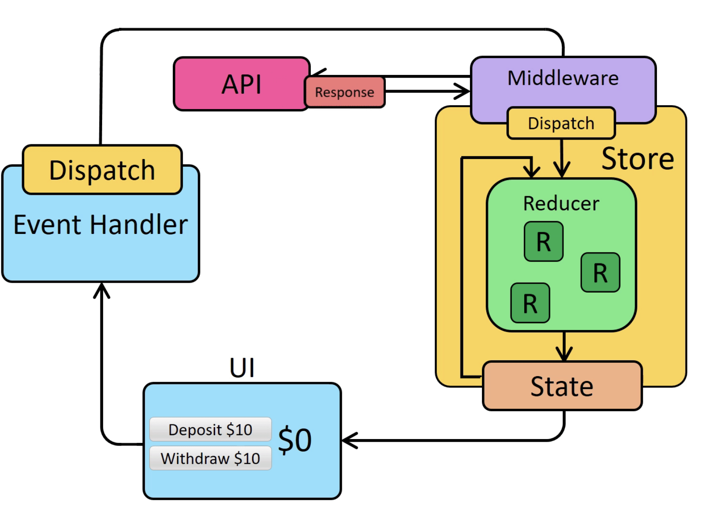

# CLASS 38 Redux - Asynchronous Actions

*All notes taken from reading material*

## Redux Fundamentals, Part 6: Async Logic and Data Fetching

1. Why use Redux middleware?

By itself, a Redux store doesn't know anything about async logic. It only knows how to synchronously dispatch actions, update the state by calling the root reducer function, and notify the UI that something has changed. Any asynchronicity has to happen outside the store.

Earlier, we said that Redux reducers must never contain "side effects". A "side effect" is any change to state or behavior that can be seen outside of returning a value from a function.

**Redux middleware were designed to enable writing logic that has side effects.**

2. Consider the Redux Async Data Flow Diagram. Describe the flow in your own words.

3. How are we accommodating async in our Redux app?

When we add async logic to a Redux app, we add an extra step where middleware can run logic like AJAX requests, then dispatch actions. 

Redux "Thunk" middleware. 

## [redux-thunk](https://github.com/reduxjs/redux-thunk)

1. Why would you need redux-thunk middleware?

It allows writing functions with logic inside that can interact with a Redux store's dispatch and getState methods.

2. Redux Thunk middleware allows you to write action creators that return a ____ instead of an action.

Redux Thunk middleware allows you to write action creators that return a function instead of an action. The thunk can be used to delay the dispatch of an action, or to dispatch only if a certain condition is met. The inner function receives the store methods dispatch and getState as parameters.

3. Describe how any return value from the inner thunk function will be made available.

The inner function receives the store methods dispatch and getState as parameters.

Any return value from the inner function will be available as the return value of dispatch itself. 